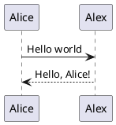

# specs
Specifications for the server-state project's core aspects

**Please note** that this repo contains specifications for the core modules of the project, i.e., primarily [server-base](https://github.com/server-state/server-base) and [client-base](https://github.com/server-state/client-base). Specifications specific to modules (e.g., grammars for [linux-raid-module](https://github.com/server-state/linux-raid-module) will exist in the specific module's repository.

### Languages and formats
Supported document formats for this repo are

- PNG, SVG, GIF, JPG
- LaTeX (with compiled PDF alongside it)
- Markdown (`.md`)

While other formats are acceptable, you should not use them when not necessary.

#### Special supported Markdown Syntax
As the main deployment of these docs gets built with docsify (and some plugins, cf. `index.html`), we support special Markdown features such as callouts, LaTeX and PlantUML. You can find a list of them below.
##### LaTeX
```markdown
$O(n)$

$$O(n)$$
```

results in

$O(n)$

$$O(n)$$

##### Emoji
```markdown
:wink: :smile: :tada:
```

results in

:wink: :smile: :tada:

##### PlantUML
````markdown

````

results in


##### Callouts
```markdown
> [!NOTE]
> A note

> [!TIP]
> A little secret tip: Stay calm.

> [!WARNING]
> A warning

> [!DANGER]
> A critical warning
```

results in

> [!NOTE]
> A note

> [!TIP]
> A little secret tip: Stay calm.

> [!WARNING]
> A warning

> [!DANGER]
> A critical warning
