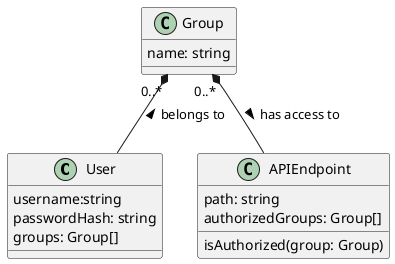

# Authentication

## Authentication flow (diagram)


## Implementation inside `server-base`
- Inside the config, we pass an optional parameter called `isAuthorized`. It has the type signature `(req: ExpressRequest, authorizedGroups: string[]) => boolean` and is a function that, based on the request (which could include a token or other authentication data) and a list of authorized groups (e.g., `['admins', 'developers']` for one endpoint and `['admins', 'developers', 'project-management']` for another) determines whether the current user has the authorization to make that request. It returns `true` if the user has the authorization and `false` if he/she is not.
- When the above function returns `false`, no code may get executed and an `HTTP 403` response gets returned
- When we register no authorized groups for an endpoint, for security reasons, no authorization should get assumed in any case, meaning calling the method gets skipped.
- If `isAuthorized` is `undefined` or `null`, no authorization check gets performed and the authorization (i.e., `isAuthorized() === true`) gets assumed
- **Breaking Change:** `authorizedGroups: string[]` gets added as third argument for `addModule()`, moving `options: *` to fourth position. These groups get stored and passed into `isAuthorized` when the module gets executed.

## Groups and Permissions
A user belongs to $0..n$ groups. To which groups a user belongs gets determined by the Authentication service.


### Group names
Group names can contain letters, numbers and dashes. Thus, they follow the following Regular Expression:

```regexp
[a-zA-Z0-9-]+
```

Group names are case-insensitive and get evaluated after getting transformed to lowercase, meaning `admins` is equal to `AdMiNS` to make configuration easier.

Typical examples of groups include:
- `admin`
- `devops`
- `developer`
- `user`
- `guest`

### Permissions and Endpoints
<!-- TODO -->
