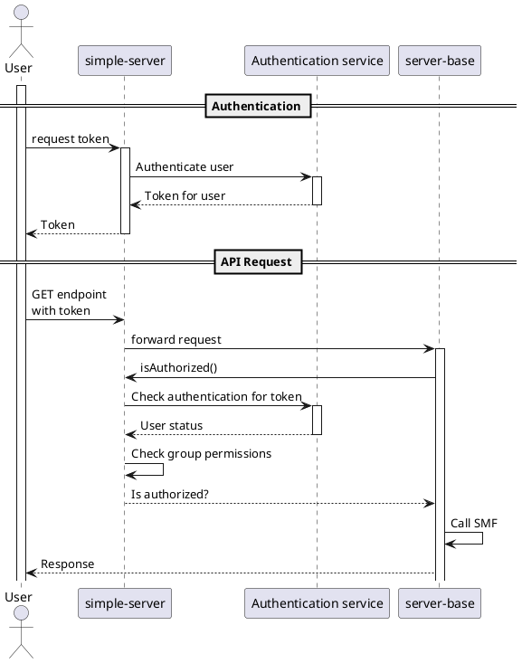

# Authentication

## Authentication flow (diagram)

## Implementation inside `server-base`
- Inside the config, an optional parameter called `isAuthorized` is passed. It has the type signature `(req: ExpressRequest, authorizedGroups: string[]) => boolean` and is a function that, based on the request (which could include things like a token or other Auth data) and a list of authorized groups (e.g., `['admins', 'developers']` for one endpoint and `['admins', 'developers', 'project-management']` for another) determines whether the current user is authorized to make that request. It returns `true` if the user is authorized and `false` if he/she is not.
- When the above function returns `false`, no code may get executed and an `HTTP 403` response shall get returned
- When no authorized groups are registered for an endpoint, for security reasons, no authorization should get assumed in any case, meaning calling the method gets skipped.
- If `isAuthorized` is `undefined` or `null`, no authorization check shall get performed and the authorization (i.e., `isAuthorized() === true`) shall get assumed
- **Breaking Change:** `authorizedGroups: string[]` shall get added as third argument for `addModule()`, moving `options: *` to fourth position. These groups get stored and passed into `isAuthorized` when the module gets executed.
