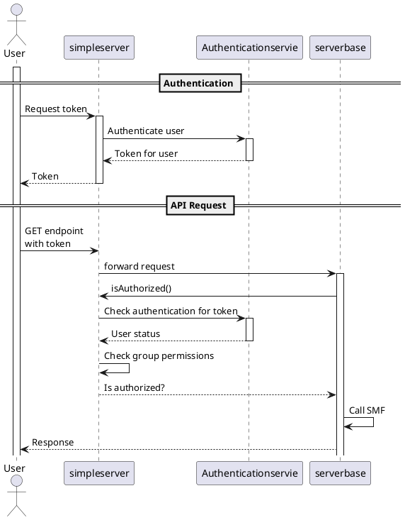

# Authentication

Coming soon

```plantuml
@startuml
actor User

== Authentication ==

activate User
User->simpleserver:Request token
activate simpleserver
simpleserver->Authenticationservie:Authenticate user
activate Authenticationservie
simpleserver<--Authenticationservie:Token for user
deactivate Authenticationservie
User<--simpleserver:Token
deactivate simpleserver

== API Request ==
User->simpleserver:GET endpoint \nwith token
simpleserver->serverbase:forward request
activate serverbase

serverbase->simpleserver:isAuthorized()
simpleserver->Authenticationservie:Check authentication for token
activate Authenticationservie
simpleserver<--Authenticationservie:User status
deactivate Authenticationservie

simpleserver->simpleserver:Check group permissions
simpleserver-->serverbase:Is authorized?
deactivate simpleserver
serverbase->serverbase:Call SMF
User<--serverbase:Response
@enduml
```
