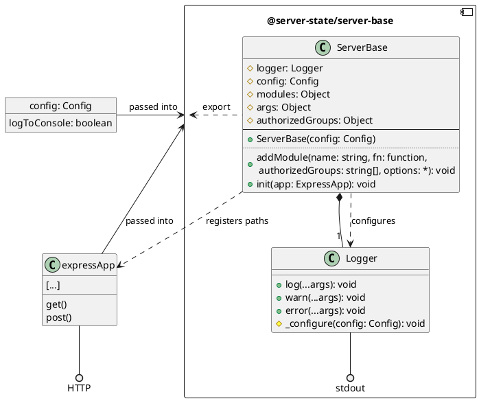

# @server-state/server-base

|Info|Value|
|---|---|
|Repository|https://github.com/server-state/server-base|
|NPM Package|[`@server-state/server-base`](https://www.npmjs.com/package/@server-state/server-base)|
|Package version||
|CI Build||
|Issues|[GitHub Issues](https://github.com/server-state/server-base/issues?q=is%3Aissue+is%3Aopen+sort%3Aupdated-desc)|

Server-side (NodeJS based) implementation of the server-base architecture (no modules included).

Responsible for creating the routes described in [API Routes](/api/server-base.md).

## General structure



## Usage Example
```shell
npm install @server-state/server-base
``` 

`index.js`:

```js
const express = require('express');
const SB = require('@server-state/server-base');

const app = express();

const serverBase = new SB({
    logToConsole: true
});

serverBase.addModule(
    'static', 
    () => 'Hello World', 
    ['guest']
);

serverBase.init(app);
app.listen(8080);
```
