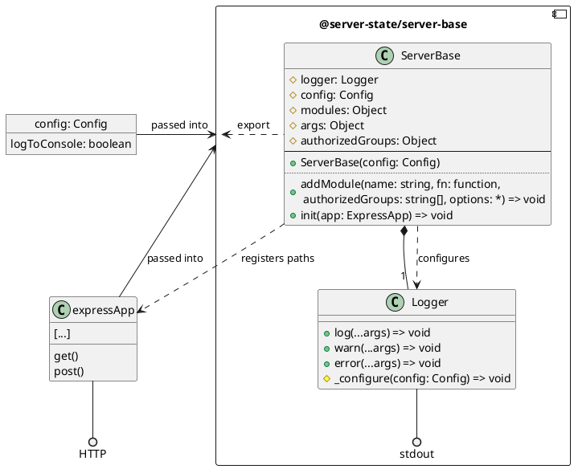

# @server-state/server-base

|Info|Value|
|---|---|
|Repository|https://github.com/server-state/server-base|
|NPM Package|[`@server-state/server-base`](https://www.npmjs.com/package/@server-state/server-base)|
|Package version||
|CI Build||
|Issues|[GitHub Issues](https://github.com/server-state/server-base/issues?q=is%3Aissue+is%3Aopen+sort%3Aupdated-desc)|

Server-side (NodeJS based) implementation of the server-base architecture (no modules included).

Responsible for creating the routes described in [API Routes](/api/server-base.md).

The module exports the class `ServerBase`.

## General structure



## `class ServerBase`
A class for creating a server-state server. This handles modules and responses and has to get attached to an Express app.

#### `constructor(config: SBConfig)`
Creates a `ServerBase` instance that can then get attached to an Express application.

##### Parameters
- `config: SBConfig` Configuration for the server-base module, including options for logging


#### `addModule(name: string, moduleFunction: (options: *) => * | Promise<*>, authorizedGroups: string[], moduleOptions?: *) => void`
Adds a server module function (as specified in [SMF](/terminology/server-module-function.md)) under a given name resulting in a server module function (as specified in [SM](/terminology/server-module.md)), making it available under `/api/v1/[name]`.

Runs in $O(1)$

##### Parameters
* `name: string` The name of the module. Must be unique (i.e., not registered before). Otherwise, we'll skip the module and an error message logged.
* `moduleFunction: (options: *) => * | Promise<*>` The function defining the module (SMF). Must either return a Promise for or a JSON serializable value or throw with an error message in case of failure (resulting in the error message getting logged and a `HTTP 500` response).
* `authorizedGroups` Groups authorized to access this module
* `moduleOptions` Options getting passed to the SMF as first argument. Can be any type, but most of the times will be a configuration object.

#### `init(app: ExpressApp) => void`
Attaches the server base to the passed Express `app`, handling routes under `/api/` there.

Runs in $O(n)$, where $n$ is the number of registered modules.

##### Parameters
* `app: ExpressApp` The Express app to which the routes get added.

## `class Logger`
#### `_configure(config: SBConfig) => void`
Update the logger configuration

##### Parameters
* `config: SBConfig` The new parameters of the config.

#### `log(...args) => void`
Logs `args`, the way `console.log(...args)` would to the places specified by the config
#### `warning(...args) => void`
Logs `args`, the way `console.warning(...args)` would to the places specified by the config
#### `error(...args) => void`
Logs `args`, the way `console.error(...args)` would to the places specified by the config

## `type SBConfig`
Typedef of the configuration object for the server-base module

#### `logToConsole?: boolean = true`
If true, messages will get logged via stdout and stderr
#### `logToFile?: boolean = false`
If `true`, messages will get logged to the file specified as `logFilePath`.
#### `logFilePath?: string = './server-state.log`
Path to the file in which messages should get logged (in case `logToFile` is `true`).

#### `isAuthorized?: (req: Express.Request, authorizedGroups: string[]) => boolean`
A callback that checks whether the current user (of the request) has authorization to access the resource

##### Parameters
- `req: ExpressRequest` The HTTP request to process tokens or other forms of authentication
- `authorizedGroups: string[]` The groups that have the authorization to access the resource

##### Returns
Authorized? In other words: Is there an intersection between the groups the user belongs to and `authorizedGroups`?

## Route timing
Let $n$ be the number of registered modules.

Assuming `isAuthorized(req, authorizedGroups)` runs in some time complexity $T$, returning the endpoints values will be a problem of the following complexity:

- `[api-url]/all`: $O(n) * T$
- `[api-url]/[module]`: $O(1) + T$
- `[api-url]/[module]/permissions`: $O(1)$


## Usage Example
```shell
npm install @server-state/server-base
``` 

`index.js`:

```js
const express = require('express');
const SB = require('@server-state/server-base');

const app = express();

const serverBase = new SB({
    logToConsole: true
});

serverBase.addModule(
    'static', 
    () => 'Hello World', 
    ['guest']
);

serverBase.init(app);
app.listen(8080);
```

## References & other sources
- [API Routes by `server-base`](/api/server-base.md)
- [Authentication details for `server-base`](/arch/authentication.md?id=implementation-inside-server-base)
