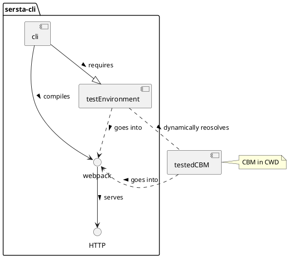

# CLI (@server-state/cli)

General structure:

```plantuml
@startuml
component testedCBM
note right
    CBM in CWD
end note

package "sersta-cli" {
component "cli"
component testEnvironment

[cli] --|> [testEnvironment]: > requires

[cli] --> webpack: > compiles
webpack --> HTTP: > serves
[testEnvironment] ..> webpack: > goes into
[testedCBM] ..> webpack: > goes into
}

[testEnvironment] .. [testedCBM]: > dynamically reosolves
@enduml
```

## Repositories
- [CLI](https://github.com/server-state/cli)
- [CBM Test Environment](https://github.com/server-state/cbm-test-environment)
