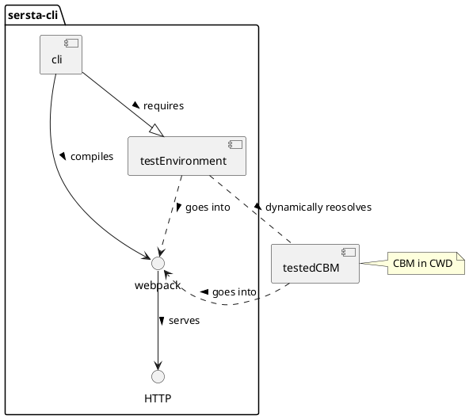

# CLI (@server-state/cli)

A Command-Line Interface for developing server-state modules (CBMs and SMs).
One can install it via `npm` (or `yarn`):

```shell
npm install -g @server-state/cli
# Or Yarn:
yarn add -g @server-state/cli

# Run it:
server-state <command>
```
 
or use it directly with `npx`:

 ```shell
npx @server-state/cli <command>
```
 
Installing it creates an executable in the `PATH` called `server-state`.

## General structure



## Repositories
- [CLI](https://github.com/server-state/cli)
- [CBM Test Environment](https://github.com/server-state/cbm-test-environment)

## `server-state init`
Initializes a new CBM, SM or both.

## `server-state start [path-to-cbm]`
Start the CBM test environment for the CBM in `[path-to-cbm]` (CWD by default).

## `server-state build`
Build the CBM for production-use (or for publishing it to npm)

## `server-state test`
Run the jest tests defined in the CBM's `tests` folder.

## `server-state test-e2e`
Start the e2e tests using cypress. 
